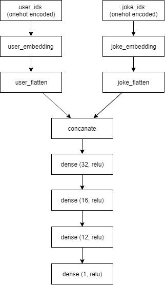
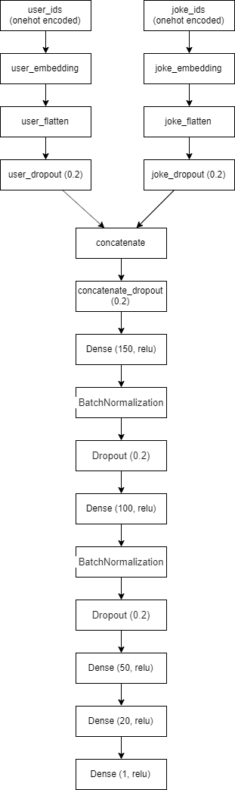
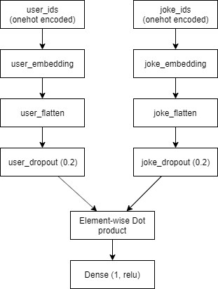
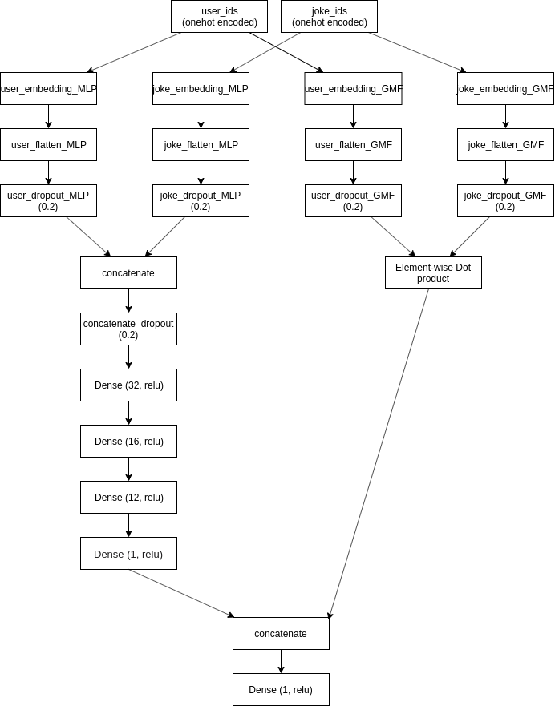
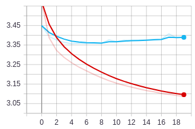
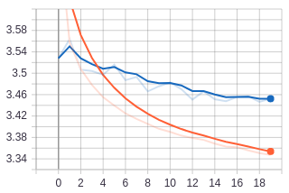
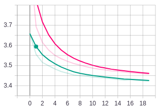

# Dokumentácia riešenia
**Autori: Marek Drgoňa, Daniel Pekarčík**

Cieľom projektu je návrh a implementácia neurónovej siete, ktorá je schopná odporúčať v doméne vtipov. Naša úloha má charakter 
regresie, pretože naša sieť predikuje aké hodnotenie dá používateľ X vtipu Y. Hodnotenia sú z intervalu reálnych čísiel <-10, 10>

## Úvod
Úvod spoločne s motiváciou a opisom existujúcich prác je uvedený v súbore [Project_proposal.ipynb](https://github.com/mdrgona/nsiete_project/blob/master/Project_proposal.ipynb).

## Analýza dát
Analýza dát je vypracovaná v súbore [Data_analysis.ipynb](https://github.com/mdrgona/nsiete_project/blob/master/notebooks/Data_analysis.ipynb).

## Trénovacia rutina
Trénovanie modelu pozostáva na najvyššej úrovni z nasledujúcich krokov:
1. Načítanie a spracovanie dát
2. Trénovanie modelu
3. Vyhodnotenie

V ďalšej časti si opíšeme jednotlivé kroky trénovacej rutiny detailnejšie.

### Načítanie a spracovanie dát:
Dataset je vo formáte .csv. Jeho charakteristika je uvedená v rámci analýzy dát. Po načítaní rozdelíme dataset 
na trénovaciu a testovaciu podmnožinu, v pomere 80:20. ID používateľov a vtipov nastavíme, 
aby boli z intervalu <0,počet používateľov (resp. vtipov)>. 
Následne neurónovú sieť trénujeme použitím iba trénovacej podmnožiny, ktorá sa ešte ďalej rozdelí na trénovaciu a validačnú 
v pomere 90:10.

Celkové rozdelenie datasetu je teda naslednovné:
* **Trénovanie:  72%** 	(754 974 záznamov)
* **Validácia: 8%**	 (83 886 záznamov)
* **Testovanie: 20%** (209 716 záznamov)

### Trénovanie modelu
Popri trénovaní máme pre všetky varianty modelov nastavené nasledovné parametre rovnako:
* optimizer: Adam
* loss: mean absolute error

Používame viacero modelov (a ich variantov):

#### 1a) Viacvrstvovy perceptron 1 (MLP-1)
Tento model sme navrhli ako prvý a predstavuje východiskový variant (angl. baseline). 
Typ a počet vrstiev, počet neurónov v rámci vrstiev a ďalšie parametre boli skúšané náhodne (a manuálne).
Architektúra NN je na obrázku

#### 1b) Viacvrstvovy perceptron 2 (MLP-2)
Pôvodný variant MLP sme upravili podľa existujúcej práce [1]. Úprava spočívala najmä v pridaní zopár 
nových skrytých vrsiev (dropout a batch-normalization) a zvýšeniu počtu neuronov na vrstách. 
Očakávame zlepšenie pôvodného variantu.
Architektúra NN je na obrázku

#### 2) GMF
GMF (General matrix factorization) predstavuje deep learning prístup ku klasickej faktorizácii matíc. 
Architektúra NN je na obrázku

#### 3) MLP-1 + GMF
Na základe existújucich riešení bolo zistené, že spojenie predošlých 2 typov modelov zlepšuje výsledky. 
Preto sme sa rozhodli aj my navrhnuté modely spojiť do jedného celkového.
Architektúra NN je na obrázku

#### SVD
SVD predstavuje state-of-the-art pristup v doméne odporúčaní, ktorý sme použili s cieľom porovnať naše riešenia.

### Vyhodnotenie
Natrenované modely sme vyhodnocovali použitím testovacej podmnožiny datasetu. Pre každý záznam v testovacich dátach
bolo predikované hodnotenie a následne overené, ako veľmi sa líši od očakavaného hodnotenia.

Modely a ich varianty sme vyhodnocovali pomocou nasledujúcich metrík:
* Mean absolute error (MAE)
* Precision@10

**MAE**
Metrika MAE (v preklade priemerná absolutná chyba) vyjadruje sumu priemerných chýb medzi očakávanou a predikovanou hodnotou. Pre každý záznam z testovacej podmnožiny sa predikuje hodnota, tá sa odčíta od očakávanej a z výsledku je spravená absolutná hodnota. Rovnaký proces sa vykoná so všetkými zaznámami a suma sa vydelí počtom záznamov.

**Precision@10**
Natrénovaným modelom sme skúsili vygenerovať pre používateľa odporúčania a vyhodnocovali sme ich presnosť metrikou precision@10. Pomocou natrénovaného modelu sme predikovali všetky hodnotenia pre používateľa a odporučili mu 10 najlepšie hodnotených vtipov. 

## Výsledky experimentov

### Experiment 1 (MLP-1)
V prvom experimente sme natrénovali model MLP-1 (architektúra uvedená vyššie v rámci časti 1.a). Model bol natrénovaný použitím **20 epoch**. Trénovanie trvalo takmer 30 minút. Graf stratovej funkcie je na nasledujúcom obrázku.

Stratová funkcia trénovacej podmnožiny začala na 3.449 a po 20 epochách neustáleho klesania dosiahla úroveň 3.095.
Stratová funkcia validačnej podmnožiny najprv klesala, avšak po 8. epoche začala pomaly stúpať. Ideálne by bolo, keby sme stopli trénovanie modelu po tejto epoche.

Po evaluácií sme dostali takéto výsledky:
* Mean absolute error: **3.3987**
* Precision@10: **0.0603**

### Experiment 2 (MLP-2)
V druhom experimente sme použili väčší model MLP-2 (architektúra uvedená vyššie v rámci časti 1.b). Taktiež sme trénovali 20 epoch, čas trvania je takmer 40 minút. Graf stratovej funkcie je na nasledujúcom obrázku.

V tomto prípade nám postupne klesala stratová funkcia aj nad trénovacou aj validačnou časťou, ale hodnota výslednej stratovej funkcie (aj trénovacej aj validačnej) nedokázala prekonať hodnoty predchádzajúceho modelu.

Prekvapením bolo taktiež vyhodnotenie metrík:
* Mean absolute error: **3.4636**
* Precision@10: **0.0633**

Keďže vrstvy a parametre tohto modelu boli použité podľa existujúcej práce, očakávali sme zlepšenie pôvodného modelu. Avšak, v našom probléme sa lepším riešením javí byť jednoduchší model s menším počtom vrstiev a neurónov na nich. Metrika Precision@10 síce dosiahla mierne lepší výsledok, no MAE tohto modelu je horšie.

### Experiment 3 (GMF)
Ďalším experimentom bolo použitie modelu GMF (architektúra uvedená vyššie v rámci časti 2). Trénovanie 20 epoch, čas trvania takmer 29 minút. Graf stratovej funkcie je na nasledujúcom obrázku.

V tomto prípade hladko klesali obe stratové funkcie počas celého trvania trénovania. Ich hodnoty sú porovnateľné s predchádzajúcimi modelmi.

Výsledky GMF modelu sú nasledovné:
* Mean absolute error: **3.4272**
* Precision@10: **0.0635**

Opäť nastalo mierne zlepšenie metriky Precision@10, no čo sa týka MAE, nebol prekonaný prvý model (MLP-1). Avšak, GMF ukazuje lepšiu úspešnosť ako zložitejší model MLP-2

### Experiment 4 (MLP-1 + GMF)

### Vysledok SVD

Precision@10:    : 

| Model   | Mean absolute error | Precision@10 |
|---------|---------------------|--------------|
| MLP-1   |      3.3987         |    0.0603    |
| MLP-2   |      3.4636         |    0.0633    |
| GMF     |      3.4272         |    0.0635    |
| MLP+GMF |                     |              |
| SVD     |                     |              |

## Referencie
[1] [Xiangnan He, Lizi Liao, Hanwang Zhang, Liqiang Nie, Xia Hu, and Tat-Seng Chua. 2017. Neural Collaborative Filtering. In Proceedings of the 26th International Conference on World Wide Web (WWW '17). International World Wide Web Conferences Steering Committee, Republic and Canton of Geneva, Switzerland, 173-182. DOI: https://doi.org/10.1145/3038912.3052569](https://dl.acm.org/citation.cfm?id=3052569)
